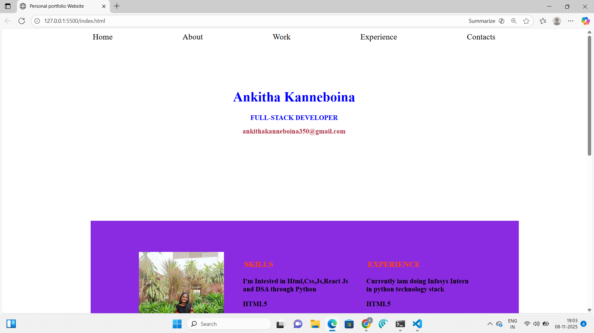
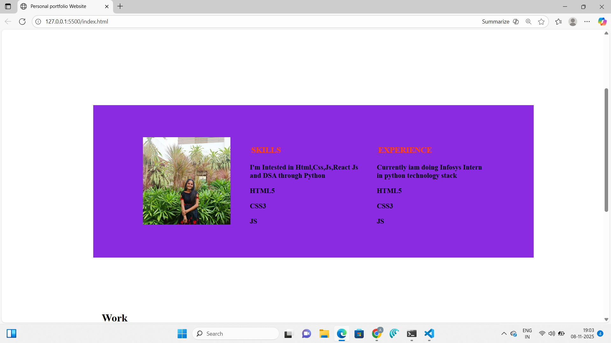
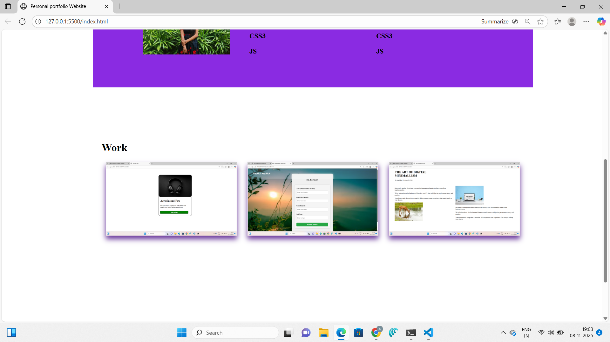
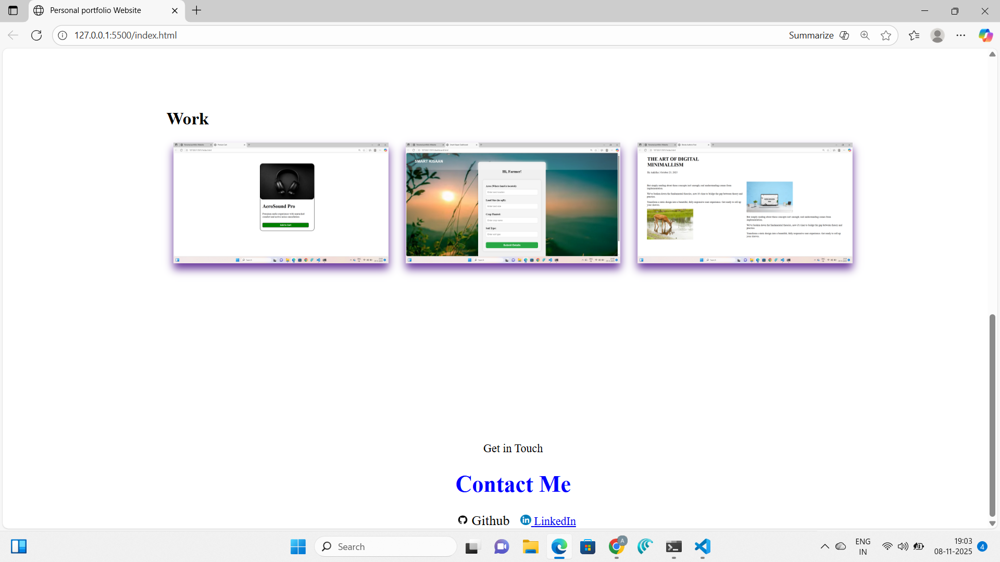

# 🌟 Personal Portfolio Website

A sleek, responsive, and modern **Personal Portfolio Website** built to showcase my projects, skills, and achievements.  
Designed to impress recruiters and collaborators with a clean UI, smooth animations, and professional presentation.

---

## 🧭 Table of Contents

- [About the Project](#about-the-project)
- [Features](#features)
- [Project Structure](#project-structure)
- [Tech Stack](#tech-stack)
- [Screenshots](#screenshots)
- [Setup & Installation](#setup--installation)
- [Live Demo](#live-demo)
- [Contact](#contact)
- [License](#license)

---

## 🖼️ Screenshots

A glimpse of my **Personal Portfolio Website** — designed with a clean, modern, and fully responsive layout.

### 🏠 Home Section  
Showcases my name, role, and an engaging background animation or hero image.

---

### 👩‍💻 About Me  
Highlights my personal introduction, background, and technical expertise.

---

### 💼 Projects Showcase  
Displays my featured projects with images, GitHub links, and short descriptions.

---

### 🧠 Skills Section  
Includes icons and visuals of the tools, frameworks, and languages I use.

---

### 📞 Contact Section  
Features a working contact form, social media links, and a professional layout for recruiters to reach out easily.

## 📖 About the Project

This **Personal Portfolio** highlights my technical expertise, creative design, and professional journey in one place.  
It serves as my **digital resume** — enabling visitors and recruiters to explore my skills, projects, certifications, and contact information.

The portfolio focuses on:
- A minimalist design
- Fast load times
- Engaging animations
- Clear navigation
- Easy scalability for future updates

---

## ✨ Features

✅ **Home Section** – Clean intro with name, title, and animated background.  
✅ **About Me** – Short bio, education, and skills overview.  
✅ **Projects Showcase** – Highlighting major works with images, descriptions, and GitHub links.  
✅ **Skills Section** – Tech stacks displayed with icons.  
✅ **Resume Download** – Option to download resume in PDF format.  
✅ **Contact Form** – Visitors can contact via email or form submission.  
✅ **Fully Responsive** – Works smoothly on mobile, tablet, and desktop.  
✅ **Smooth Scroll & Animations** – Modern transitions using CSS and Framer Motion (if React).  

---

## 🧱 Project Structure

portfolio/
├── index.html
├── about.html
├── projects.html
├── contact.html
├── style.css
├── script.js
└── images/

🧰 Tech Stack
Category	Technologies
Frontend	HTML5, CSS3, JavaScript (or React.js / Vite)
Styling	Tailwind CSS / Bootstrap / Custom CSS
Animations	AOS / Framer Motion / GSAP
Deployment	GitHub Pages / Netlify / Vercel
Version Control	Git & GitHub

🚀 Live Demo

🎯 Live Website: http://127.0.0.1:5500/index.html#Home
💻 GitHub Repository: https://github.com/ankithakanneboina/personalportfoliowebsite

⚙️ Setup & Installation

how to run project:

git clone https://github.com/ankithakanneboina/personalportfoliowebsite.git

cd portfolio

run through liveserve or webbrowser

💌 Contact

I’d love to connect with recruiters, collaborators, and fellow developers!

📧 Email: ankithakanneboina350@gmail.com

💼 LinkedIn: https://www.linkedin.com/in/ankitha-kanneboina-45a545324/

🐙 GitHub: github.com/ankithakanneboina

🌐 Portfolio Live: your-portfolio-link.netlify.app
This project is open source and available under the MIT License

